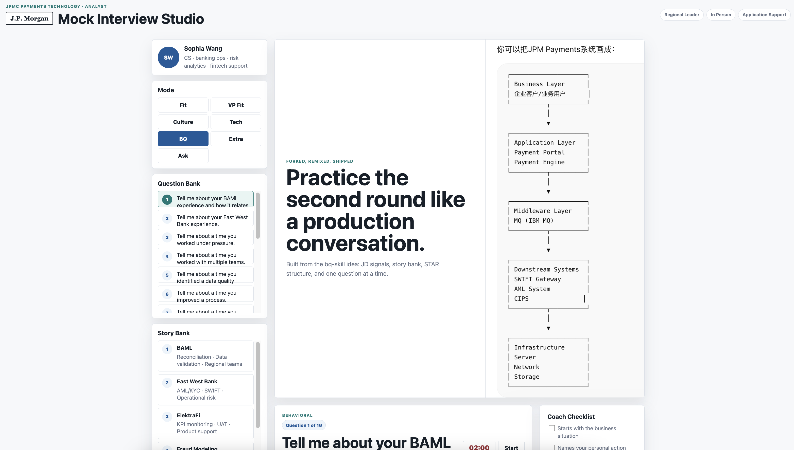
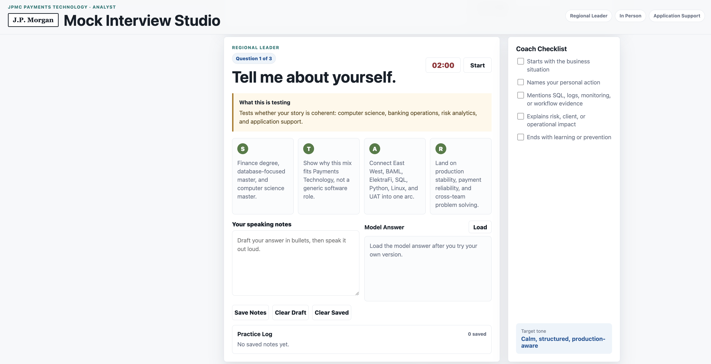
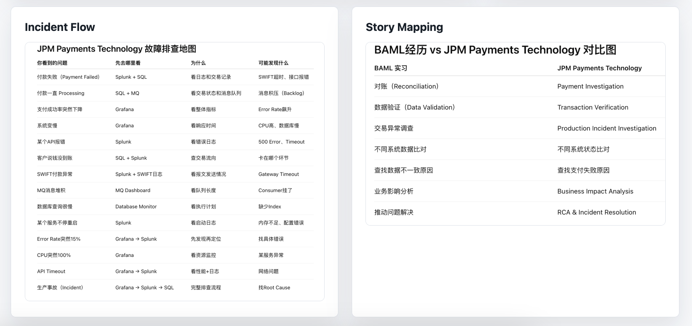

# JPMC Mock Interview Studio

A GitHub Pages-ready mock interview page for the J.P. Morgan Software Engineer interview.

## About

This project is a personal mock interview and study tool built for practicing application support, payments technology, behavioral interview, and technical storytelling questions.

It does not include, reproduce, or disclose any real interview questions, private recruiter communication, confidential company information, internal materials, or non-public interview details. All prompts and answers are self-created practice content based on public job-description themes, general application-support concepts, and personal resume/project experience.

## Preview

### Home and Story Bank

### Mock Practice Workspace

### Incident and Story Mapping Visuals

## What it includes

- Regional leader, technical, and behavioral practice modes
- JD-driven question bank
- STAR prompts for each answer
- Story bank mapped to BAML, East West Bank, ElektraFi, fraud modeling, and AI workflow projects
- Two-minute speaking timer
- Separate speaking notes, model answers, and saved practice log
- Payment troubleshooting visuals

## Local preview

Open `index.html` in a browser.

## Publish on GitHub Pages

1. Create a new GitHub repository.
2. Upload everything in this folder.
3. Go to repository Settings.
4. Open Pages.
5. Set Source to `Deploy from a branch`.
6. Select `main` and `/root`.
7. Save and wait for the Pages URL.
